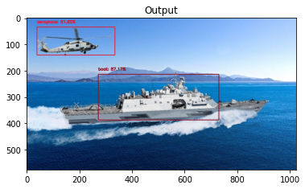

# Object Detection Single Shot Detector (SSD)



This implements Single Shot detectors and MobileNets
- combined, results in fast, real-time object detection that is computationally affordable (Raspberry Pi)
- typically you use an existing network architecture (VGG or ResNet)..however, these are very large
- large architectures are not good for resource constrained devices
- **[MobileNets](https://arxiv.org/abs/1704.04861)** designed by Google for resource constrained devices (ex. smartphone) differ from traditional CNNs via depthwise-separatable-convolution
- Trade off between accuracy and resource constrained devices
- MobileNet was first trained on COCO dataset (Common Objects in COntext)
  - COCO dataset contains photos of 91 objects types that would be easily recognizable by a 4 year old. With a total of 2.5 million labeled instances in 328k images, the creation of our dataset drew upon extensive crowd worker involvement via novel user interfaces for category detection, instance spotting and instance segmentation.
  - you can only use objects the model knows (has been trained on)  
- then, was fine-tuned on PASCAL VOC (improving accuracy)
- you can detect multiple objects in a single image with > 70% accuracy


Deep learning object detection consists of 3 primary methods:
1. Faster Region-Proposal Convolutional Nueral Network (R-CNNs)
   - common, difficult to understand, hard to implement, challenging to train
   - slow compared: 7FPS 
1. You Only Look Once (YOLO)
   - leaves a lot of accuracy
   - fast compared: 40-90 FPS on Titan X GPU (up to 155 FPS)
1. Single Shot Detector (SSD)
   - developed by Google
   - faster than R-CNNs and more accurate than YOLO 
   - fast enough: 22-46 FPS 
    

```angular2html
% tree .
.
├── MobileNetSSD_deploy.caffemodel      # weights for the model file
├── MobileNetSSD_deploy.prototxt.txt    # defines the architecture of the neural network
├── Pipefile
├── README.md
├── deep_learning_object_detection.py   # driver script
├── images                              # images to test object detection
│   ├── example_01.jpg
│   ├── example_02.jpg
│   ├── example_03.jpg
│   ├── example_04.jpg
│   ├── example_05.jpg
│   ├── example_06.jpg
│   ├── lcs-littoral-combat-ship-09.jpg
│   └── littoral-combat-ship.jpg
├── main.ipynb
└── requirements.txt

```